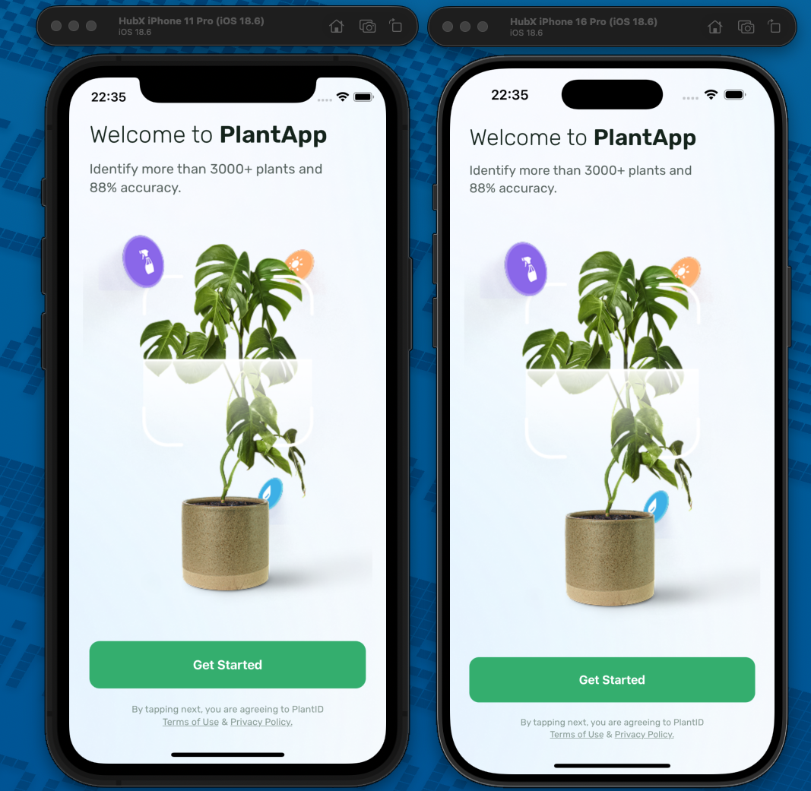
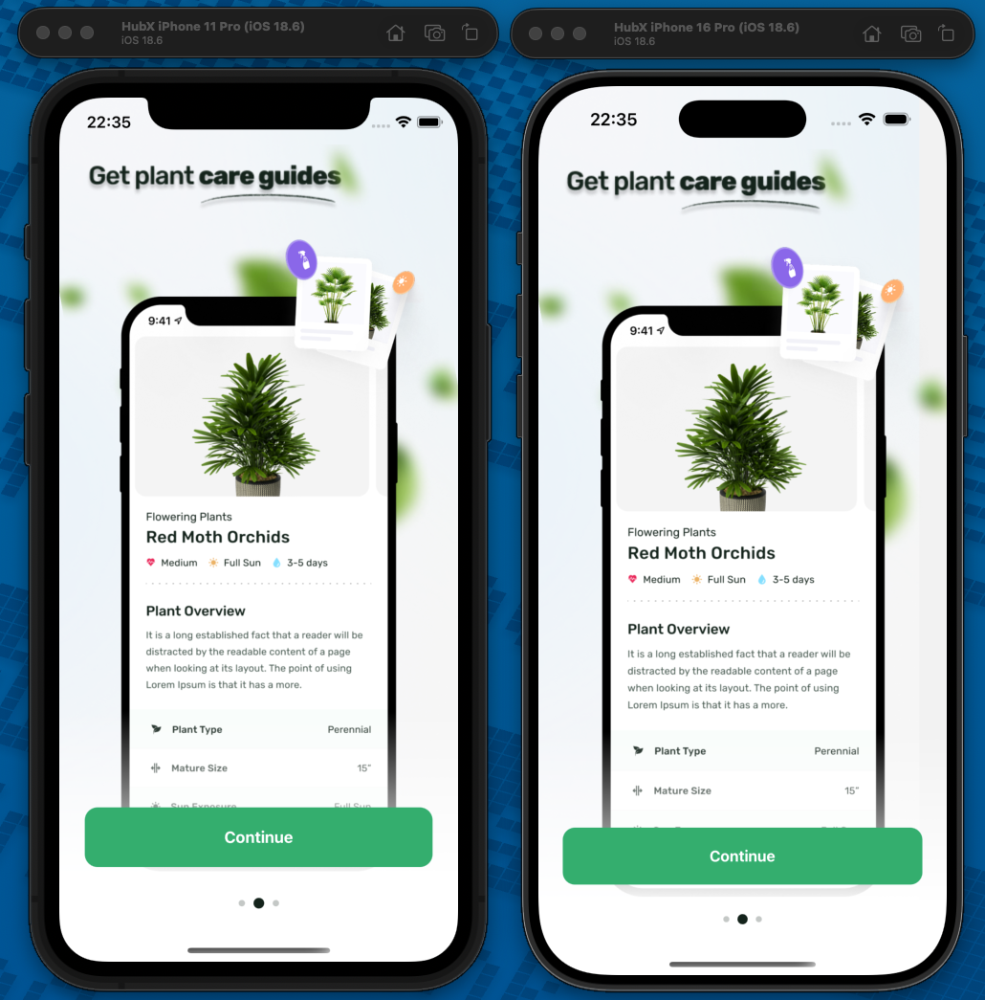
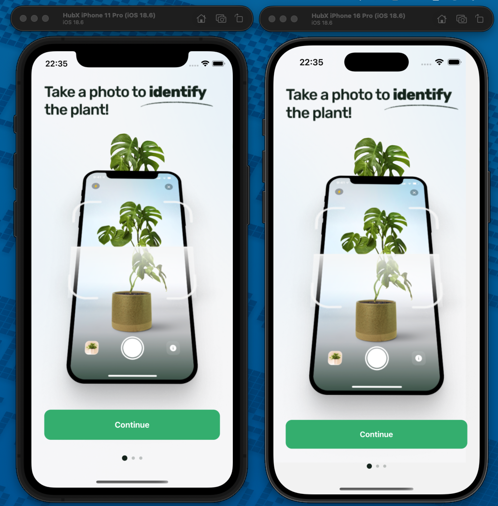
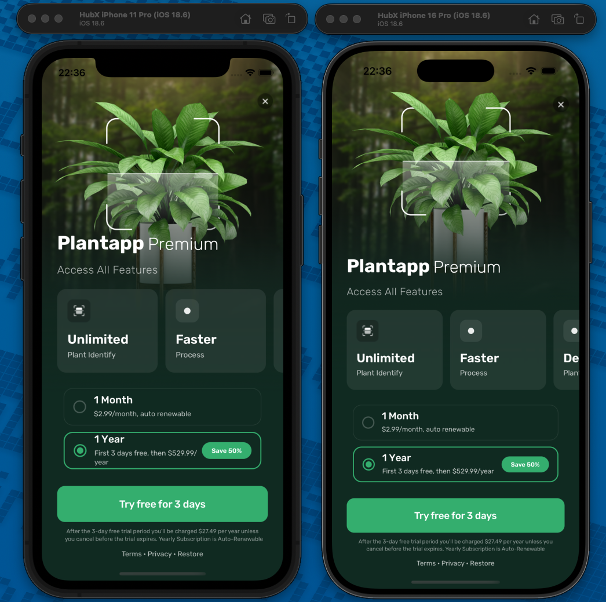
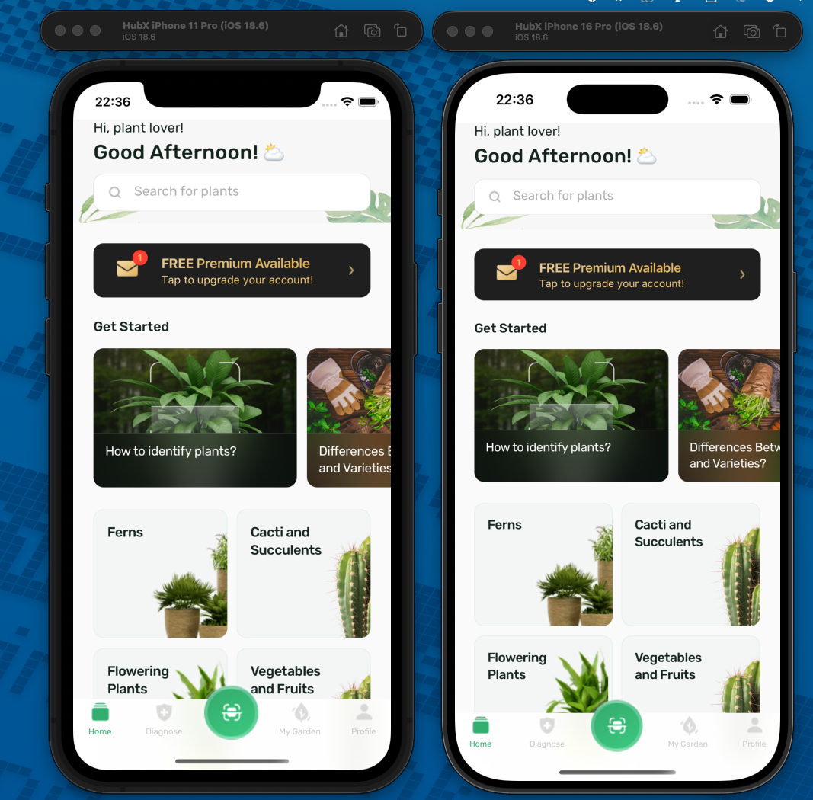

# HubX React Native Case

Bu repo, HubX React Native Developer case çalışması için geliştirilmiş Expo (SDK 52) tabanlı mobil uygulamayı içerir.

## Proje

- **Mobile app**: `mobile/`

## Gereksinimler (Environment)

- **Node.js**: LTS (öneri: 18.x veya 20.x)
- **npm**: Node ile gelir
- **Expo CLI**: `npx expo ...` ile kullanılıyor (global kurulum zorunlu değil)
- **iOS (macOS)**: Xcode + iOS Simulator

Opsiyonel:

- **Watchman**: Metro file-watcher uyarılarını azaltmak için önerilir.

## Kurulum

```bash
cd mobile
npm install
```

## Çalıştırma

```bash
cd mobile
npm run ios
```

Alternatif:

```bash
cd mobile
npm run start
```

## Test / Lint / Typecheck

```bash
cd mobile
npm test
npm run lint
npm run typecheck
npm run format
```

## Akış (Flow)

- **Onboarding flow**: Get Started → Onboarding (2 slide) → Paywall
- **Home flow**: MainTabs (Home + placeholder tab'ler)

Onboarding tamamlandıktan sonra (Paywall close) `hasOnboarded=true` persisted olarak kaydedilir ve kullanıcı bu flow'a tekrar sokulmaz.

## Screenshots

> Ekran görüntülerinde iPhone 11 Pro ve iPhone 16 Pro yan yana gösterilmiştir.

### Get Started



### Onboarding





### Paywall



### Home



## API

Kategoriler ve sorular dummy API üzerinden çekilir:

- **Categories**: `https://dummy-api-jtg6bessta-ey.a.run.app/getCategories`
- **Questions**: `https://dummy-api-jtg6bessta-ey.a.run.app/getQuestions`

## Troubleshooting

- **Watchman recrawl uyarısı**: Terminalde önerilen komutlarla watchman cache resetlenebilir.
- **Expo Go “New Architecture” uyarısı**: `mobile/app.json` içinde `newArchEnabled` set edilmiştir; Expo Go ile config uyumu sağlanır.
